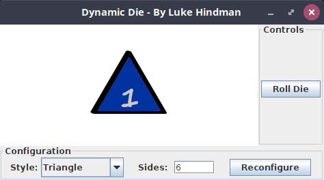
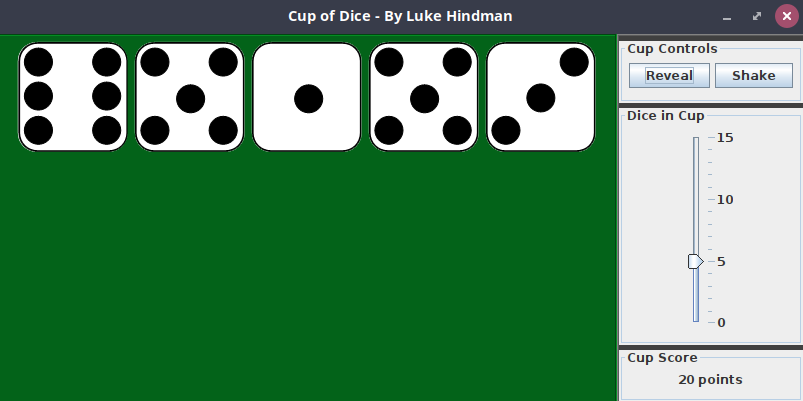

# Lab08 Guide
## Getting Started
[Lab Introduction Video](https://youtu.be/4qre8IRmaUw)
- Please clone the [Mod08 Code Examples](https://github.com/lhindman/cs121-mod08-examples.git). 

### Code Style Requirements
Please review the [CS121 Style Guide](https://docs.google.com/document/d/1LWbGQBKkApnNAzzgwOSvRM03DmhYWx5yEfecT2WXfjI/edit?usp=sharing) and apply it in all lab activities and projects this semester. Coding Style will assessed as part of your lab and project grades. 

### Code Quality Requirements
- Code must compile without warnings using openjdk11
- Code must run without errors or warnings on safe-path and edge test cases
- More to come as we learn about input validation and exception handling  
## Activity 1 - Dynamic Die
### Problem Description
In this activity, you will using the Die class and the DieButton class that we developed in the deeper look videos. This is an example of code reuse which is core principle of Object Oriented Programming. For this activity you will create a class named DynamicDie that will enable the end-user to customize both the skin and the number of sides of a single DieButton. Three custom die face image sets (skins) have been provided for up to 20 sides on a single die. They are called Triangle, Diamond and Honeycomb and you can find them in the A1-DynamicDie folder.

### Requirements
The screenshot above shows a sample GUI for this activity.  You may use the same layout or design your own.  Either way, your GUI must contain the following components

+ **DieButton:** You must include a single die button that roles when clicked.  When the program begins, the DieButton should have 6 sides and use the Triangle skin.
+ **JButton:** You must include a JButton that will role the die when clicked.
+ **JButton:** You must include a JButton that will reconfigure the exiting DieButton by first removing it from the parent panel, creating a new DieButton object with the specified number of sides and skin, then adding it back to the parent panel.  This button will also need to *revalidate* and *repaint* the parent panel to ensure the updated DieButton is displayed properly.
+ **JComboBox:** You must include a JComboBox that will allow the user to chose one of the three available skins from a dropdown list.
+ **JTextField:** You must include a JTextField to allow the user to type in the number of sides they want for their die.  Valid values are in the range of 2 through 20.  See the error handling section below for how to address unexpected values.
+ **JLabel:** You must include a JLabel that contains the text "Style" and position it near the JComboBox.
+ **JLabel:** You must include a JLabel that contains the text "Sides" and position it near the JTextField.

### Error Handling
When the reconfigure JButton is pressed, it will read the current values from the JTextField and the JComboBox.  If the user specified a non-integer value for the number of sides, you should catch the NumberFormatException and display a JOptionPane with the message "Please enter an integer value!".  If the user specified an integer value outside of the valid range [2 - 20], display a JOptionPane with the message "Please enter values in the range of 2 - 20 inclusive!".

### Implementation Guide
1. Expand the folder named A1-DynamicDie and create a new file named DynamicDie.java
2. Copy Die.java and DieButton.java from the [Mod08 Code Examples](https://github.com/lhindman/cs121-mod08-examples.git) into the A1-DynamicDie folder.
3. Design a program to satisfy the requirement in the Problem Description and enter the program code in DynamicDie.java
4. Test the program and pay particular attention to boundary/edge cases and invalid input.
5. Commit the changes to your local repository with a message stating that Activity 1 is completed.
6. Push the changes from your local repository to the github classroom repository.

## Activity 2 - Cup of Dice
### Problem Description
In this activity we are once again reusing the Die class and DieButton class from the deeper look videos. In this activity you are going to create class named CupOfDice to represent a cup of dice.  Ok, so it isn't a literal cup, but you get the idea. :).  In this activity, the end user will be able specify the number of dice in the cup from 0 to 15. The end user will be able to press a button to shake ALL the dice in the cup or click an individual die to role just that one. In order to replicate the drama and anticipation of shaking a real cup and turing it over, whenever  the dice are rolled they should hide their facevalue until the reveal button is clicked. For this program you may use either an Array or an ArrayList<DieButton> to hold the dice. When the user clicks the shake button, the Score should be blanked out. When the user clicks the reveal button, the Score should be updated with the sum of the face values of each die in the cup.
     

### Requirements
The screenshot above shows a sample GUI for this activity.  You may use the same layout and general design or create your own.  Either way, your GUI must contain the following components:
+ **DieButton:** You must use the DieButton class to represent each of the 0 - 15 dice. Each DieButton should have 6 sides, but may use any of the skins from A1 or from the Mod08 examples.
+ **Array or ArrayList:** You must use either an Array or an ArrayList to hold the DieButtons in the cup.  Each have their pros and cons and I'll leave that particular design decision to you. :)
+ **JButton:** You must use a JButton to reveal the face values on each of the die in the cup after they've been rolled.
+ **JButton:** You must use a JButton to shake the cup which in turn will role each of the diein the cup.
+ **JSlider:** You must use a JSlider combined with an AdjustmentListener to reconfigure the number of die in the cup. Each individual DieButton should be removed from the parent panel, the Array or ArrayList cleared and then new DieButtons created, added to the Array or ArrayList and added to the parent panel.
+ **JLabel:** You must use a JLabel to display the current Score to the user.  This should be set to an and empty string when the Shake button is pressed and updated with the sum of all the dice in the cup when the Reveal button is pressed.
+ **JPanels:** You must use JPanels as subpanels with TitleBorders to identify the components as shown in the screenshot above.

### Implementation Guide
1. Expand the folder named A2-CupOfDice and create a new file named CupOfDice.java
2. Copy Die.java and DieButton.java from the [Mod08 Code Examples](https://github.com/lhindman/cs121-mod08-examples.git) into the A2-CupOfDice folder.
3. Copy a die skin folder of your choice into the A2-CupOfDice folder.
4. Design a program to satisfy the requirements in the Problem Description and enter the program code in CupOfDice.java
5. Test the program and pay particular attention to boundary/edge cases and invalid input.
6. Commit the changes to your local repository with a message stating that Activity 2 is completed.
7. Push the changes from your local repository to the github classroom repository.
